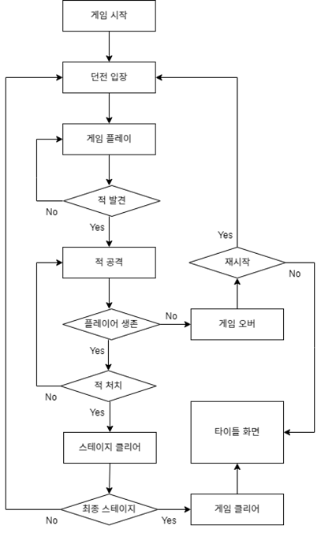

# 게임 타이틀
## BPM: Beats Per Minute

# 목차
### 1. [소개](#소개)
### 2. [게임 흐름도 & 플레이 매커니즘](#게임-흐름도--플레이-매커니즘)
### 3. [클리어 조건](#클리어-조건)
### 4. [주차 별 진행사항](#주차-별-진행사항)

# 소개

### 장르

로그라이크 슈팅 리듬 게임

  

# 게임 흐름도 & 플레이 매커니즘

### 흐름도
  
  
### 플레이 매커니즘
  플레이어가 BGM 박자에 맞춰 총을 발사 및 장전 등을 활용해 콤보카운트를 올려 각 스테이지에 있는 적들을 소탕하여 최종 스테이지까지 클리어한다.  
  단 박자가 안 맞을 시 콤보카운트가 줄어든다.  

  

# 클리어 조건

  1) 플레이어 생존  
  2) 최종 스테이지에 존재하는 보스를 처치  
  3) 적을 처치해 점수를 획득  

  

# 주차 별 진행사항

### 2주차

  1) 플레이어 이동 구현
  2) 플레이어 애니메이션 구현
  3) 플레이어 점프 구현
  4) 화면 제어 구현

### 3주차

  1) 플레이어 달리기 구현
  2) 플레이어 애니메이션 추가
  3) 플레이어 사운드 구현
  4) 총알 발사 이펙트 구현

### 4주차

  1) 재장전 기능 구현
  2) 탄피 구현
  3) 피격 이펙트 추가
  4) 탄알 UI 구현
  5) 총기 이미지 및 이름 UI 구현
  6) 조준선 UI 구현

### 5주차

  1) 리듬 노트 생성
  2) BGM 추가

### 6주차

  1) 리듬 노트 관련 오류 수정 및 개선

### 7주차

  1) 맵 에셋 찾기
  2) 맵 수정
  3) 적 프리팹 생성
     
### 8주차

  1) 메뉴씬 구현
  2) 인트로 구현
  3) 맵 기능 추가

### 9주차

  1) 아이템 오브젝트 생성(힐팩, 탄창)
  2) 포스트프로세싱, 볼륨포그 추가

### 10주차

  1) 아이템 오브젝트 생성(힐팩, 탄창)
  2) 스카이 박스 수정
  3) 반동 추가

### 11주차

  1) 포스트프로세싱, 볼륨포그 추가
  2) UI 수정

### 12주차

  1) 물 에셋 추가
  2) 메테리얼 수정

### 13주차

  1) 메뉴씬 오류 기능 수정
  2) 메테리얼 수정

